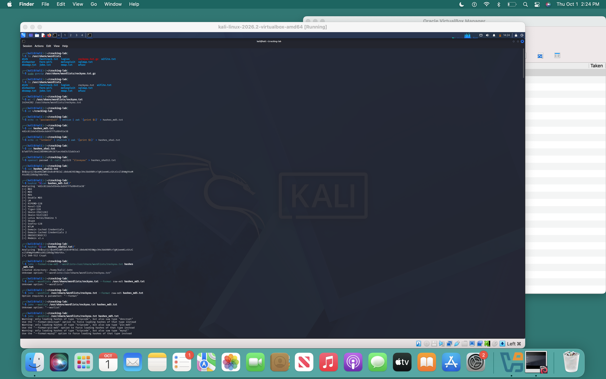
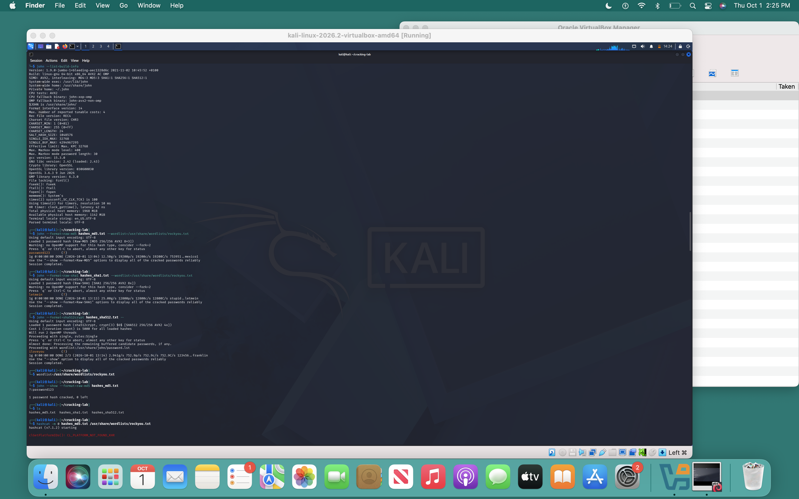
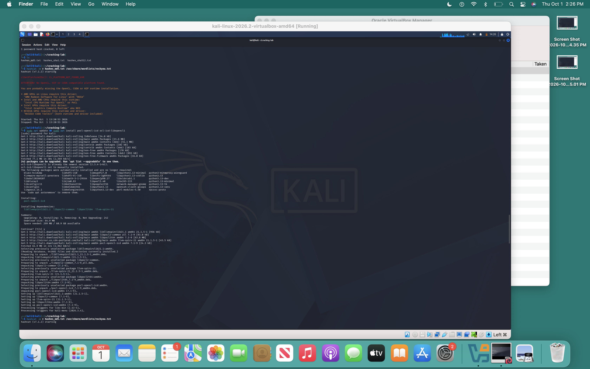
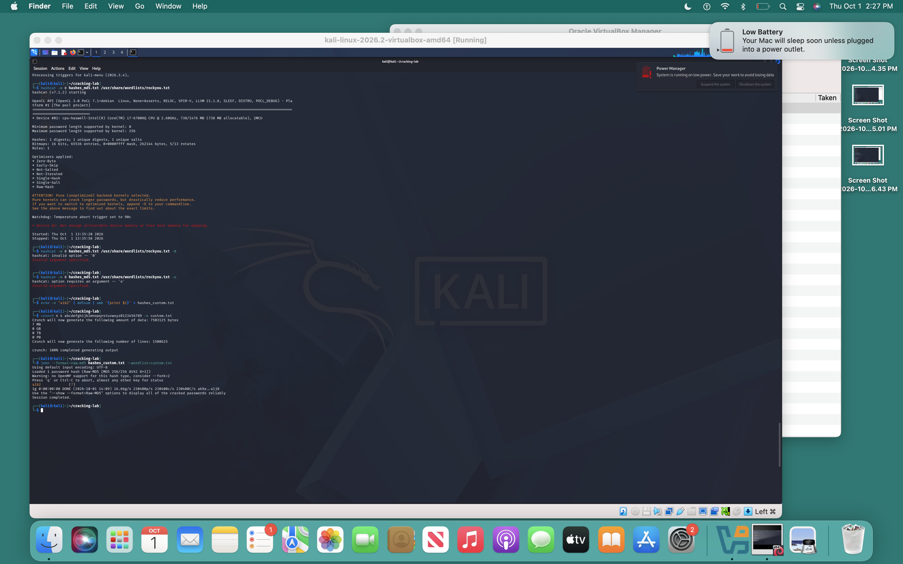

# Password Cracking Lab — Kali Linux

**Author:** Zaine
**Environment:** Kali Linux VM (self-contained — no external targets)
**Date:** October 1, 2026

---

## 1. Objective & Scope

This lab demonstrates offensive password-cracking techniques and the defensive lessons they teach, performed entirely within a single Kali Linux VM. Every hash was self-generated on the same machine, so no system other than my own was ever targeted. The goal was to practice the full workflow a SOC analyst should understand — hash identification, dictionary attacks, brute-force/generated attacks — and to connect each step to how these attacks appear and are detected in a real environment.

**Tools used (all pre-installed in Kali):** `john` (John the Ripper), `hashcat`, `hashid`, `crunch`, `openssl`, and the `rockyou.txt` wordlist.

---

## 2. Setup

Unzipped the built-in rockyou wordlist (14,344,392 passwords):

```bash
sudo gunzip /usr/share/wordlists/rockyou.txt.gz
wc -l /usr/share/wordlists/rockyou.txt   # 14344392
```

---

## 3. Hash Generation

Created three hash types to show range — two "fast" unsalted hashes and one "slow" salted hash:

| Type | Password | Command |
|------|----------|---------|
| MD5 | `password123` | `echo -n "password123" \| md5sum` |
| SHA1 | `letmein` | `echo -n "letmein" \| sha1sum` |
| sha512crypt (`$6$`) | `iloveyou` | `openssl passwd -6 -salt xyz123 "iloveyou"` |

The `$6$` prefix marks sha512crypt, and the salt (`xyz123`) is embedded directly in the hash — this is what makes two identical passwords produce different hashes.



---

## 4. Hash Identification

In a real investigation you're handed a hash with no label. Used `hashid` to fingerprint each one:

```bash
hashid "$(cat hashes_md5.txt)"
hashid "$(cat hashes_sha512.txt)"
```

**Finding:** MD5 is ambiguous — being 32 hex characters, several algorithms are plausible candidates. The `$6$` hash, by contrast, is identified confidently because its prefix is unique. Salted, prefixed formats are easier to classify *and* harder to attack.

---

## 5. Cracking with John the Ripper

```bash
john --format=raw-md5     hashes_md5.txt    --wordlist=/usr/share/wordlists/rockyou.txt
john --format=raw-sha1    hashes_sha1.txt   --wordlist=/usr/share/wordlists/rockyou.txt
john --format=sha512crypt hashes_sha512.txt --wordlist=/usr/share/wordlists/rockyou.txt
```

| Hash | Cracked value | Cracking speed | Time |
|------|---------------|----------------|------|
| MD5 | `password123` | ~19,200 c/s | < 1 sec |
| SHA1 | `letmein` | ~12,800 c/s | < 1 sec |
| sha512crypt | `iloveyou` | ~753 c/s | < 1 sec |



**Key observation:** All three cracked in under a second because the passwords were common, but the **cracking speed** tells the real story. On the exact same CPU, John tried ~19,200 MD5 candidates per second versus only ~753 for sha512crypt — roughly a **25× slowdown**. Against a password that *wasn't* a common dictionary word, that 25× gap is the difference between a crack taking minutes and taking weeks. This is the single most important result in the lab — see the defender analysis below.

---

## 6. Cracking with hashcat — Environment Finding

Attempted the same hashes in hashcat. The first run failed because no OpenCL runtime was installed, so I installed the PoCL CPU runtime and retried:

```bash
sudo apt install pocl-opencl-icd ocl-icd-libopencl1
hashcat -m 0 hashes_md5.txt /usr/share/wordlists/rockyou.txt -O
```



**Result:** After installing PoCL, hashcat successfully detected the CPU as an OpenCL device:


but then returned *"Device #1: Not enough allocatable device memory or free host memory for mapping."* The device had only **738 MB allocatable** out of a VM with roughly **2 GB total RAM** (~1.1 GB free at runtime) — well short of what hashcat's kernels need to load the attack.



**Takeaway:** This is a real-world constraint, not a configuration mistake. hashcat on a CPU inside a memory-limited VM (no GPU passthrough) can't allocate enough memory for its kernels. It's exactly why professional password-cracking is done on dedicated hardware with GPUs and ample RAM. All cracking in this lab was completed with John the Ripper, which runs comfortably CPU-only — a good example of choosing the right tool for the available environment.

---

## 7. Custom Wordlist Attack

To show an attack that a standard dictionary *cannot* perform, I set a password not present in rockyou, then generated a targeted wordlist to crack it (the crack is visible in the lower half of the screenshot in Section 6):

```bash
echo -n "a1b2" | md5sum | awk '{print $1}' > hashes_custom.txt
crunch 4 4 abcdefghijklmnopqrstuvwxyz0123456789 -o custom.txt
john --format=raw-md5 hashes_custom.txt --wordlist=custom.txt
```

`crunch` generated **1,500,625 candidate lines (~7 MB)** — every 4-character combination of lowercase letters and digits — and John cracked `a1b2` from that list in under a second at ~230,400 c/s.

**Finding:** `rockyou.txt` would never crack `a1b2` because it isn't a leaked human password. A generated/brute-force list covering all 4-character alphanumeric combinations gets it. Knowing *when* to switch from a dictionary attack to a brute-force/mask attack is a core skill.

---

## 8. MITRE ATT&CK Mapping

| Technique ID | Name | Where it appears in this lab |
|--------------|------|------------------------------|
| T1110 | Brute Force | Overall cracking activity |
| T1110.002 | Password Cracking | Offline cracking of captured hashes |
| T1003 | OS Credential Dumping | Obtaining the `$6$` shadow-style hash |
| T1110.001 | Password Guessing | Dictionary attack with rockyou |

---

## 9. Defender Analysis — Why This Matters

**1. Salting defeats precomputed attacks.** The `$6$` salt means an attacker can't use rainbow tables or reuse work across accounts — every hash must be attacked individually.

**2. Slow hashes buy time.** Fast hashes (MD5, SHA1) can be tried tens of thousands of times per second; sha512crypt is *deliberately* slow, cutting that to a tiny fraction (measured here at a ~25× slowdown on the same CPU). Modern systems should use slow, salted algorithms — **bcrypt, sha512crypt, or Argon2** — never raw MD5/SHA1.

**3. How a SOC detects credential attacks.** Offline cracking is invisible, but the activity that *produces* the hashes (and online guessing) is not. Analysts watch for:
- Repeated failed authentications — **Windows Event ID 4625**
- Account lockout spikes — **Event ID 4740**
- Access to credential stores (e.g. SAM / shadow file reads)
- Impossible-travel or anomalous successful logins after many failures

**4. The fix.** Slow + salted hashing, enforced password length/complexity, multi-factor authentication, and monitoring the events above.

---

## 10. Conclusion

This self-contained lab walked the full credential-attack workflow — generation, identification, dictionary cracking, brute-force cracking — and tied each step to both the MITRE ATT&CK framework and practical SOC detection. The standout result was the measurable ~25× performance gap between fast unsalted hashes and slow salted ones, which is the core argument for modern password-storage practices. A secondary finding — hashcat hitting a memory wall in a CPU-only VM — illustrates why serious cracking work is done on dedicated GPU hardware.
